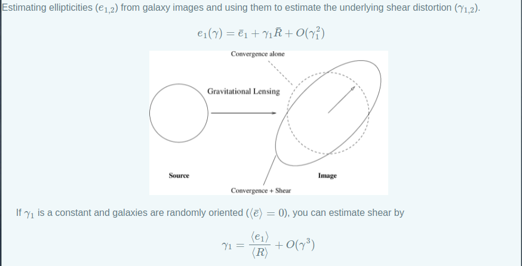

# Unit Testing

In case you have not prepared your code to implement unit test, please use the
following example code for shear estimation.

## Download and Install

```shell
git clone https://github.com/mr-superonion/meaShear.git
cd meaShear
pip install .
```

## About the code
### shear estimation

Estimating ellipticities from galaxy images and using the estimated
ellipticities to estimate the underlying shear distortion.
$$e_{1}(\gamma)=\bar{e}_1+ \gamma_1 \bar{R} + O(\gamma_1^2)$$
<p align="center">

</p>
If $\gamma_1$ is a constant, you can estimate shear by
$$\gamma_1 = \frac{\left\langle e_{1}\right\rangle}{\left\langle R \right\rangle}+ O(\gamma_1^3)$$

```python

import meaShear
import numpy as np
import astropy.io.fits as pyfits
import numpy.lib.recfunctions as rfn
# Read PSF image
psfData=pyfits.getdata('data/psf_test.fits')
# Read GAL image
print('Reading the simulated image ditorted by g_1= 0.02, g2=0.00')
galDatAll=pyfits.getdata('data/gal_test.fits')
imgList=[galDatAll[i*64:(i+1)*64,0:64] for i in range(4)]

ellRes=[]
for i in range(4):
    # input image and PSF to estimate e and R
    eR=meaShear.measureEllip(imgList[i],psfData)
    ellRes.append()

ellRes =   rfn.stack_arrays(ellRes,usemask=False)

# average over response to estimate shear
g1_est=np.average(ellRes['fpfs_e1'])/np.average(ellRes['fpfs_RE'])
g2_est=np.average(ellRes['fpfs_e2'])/np.average(ellRes['fpfs_RE'])
print('estimated shear is: g1= %.5f, g2= %.5f' %(g1_est,g2_est))
```

### ring test
Ring thest is widely applide to check the accuracy of shear estimator.


## Test Development List

+ Code performance (accuracy)
    -   Use ring test to test the accuracy of the estimator on noiseless
        galaxies
+ Inputs Control (interact correctly with users)
    -   Test to make sure the code requires the inputs galaxies and PSF images
        are ndarrays
    -   Test to make sure that if the input image has values that are
        problematic, like NaN or Inf, the code does something reasonable
    -   Test to make sure the tuning parameters in reasonable ranges
        ($0<$scale_par$<1$), (weight_par$>0$)

### Example
You can find a testing example [here](./tests/test_accuracy.py), and you can run the test by

```shell
cd tests
nosetests -v --with-coverage --cover-package=meaShear
```
